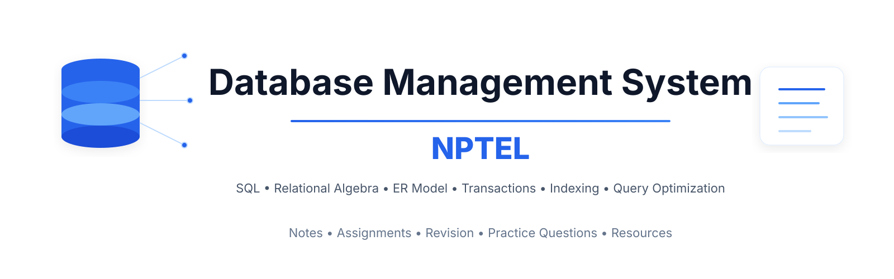

# Database Management System — NPTEL

Notes, slides, assignment solutions, and revision material for the NPTEL course **Database Management System** by Prof. Partha Pratim Das and Prof. Samiran Chattopadhyay, IIT Kharagpur.

## Syllabus

| Week | Topics |
|------|--------|
| Week 1 | Course Overview, Introduction to RDBMS |
| Week 2 | Structured Query Language (SQL) |
| Week 3 | Relational Algebra, Entity-Relationship Model |
| Week 4 | Relational Database Design |
| Week 5 | Application Development, Case Studies, Storage and File Structure |
| Week 6 | Indexing and Hashing, Query Processing |
| Week 7 | Query Optimization, Transactions (Serializability and Recoverability) |
| Week 8 | Concurrency Control, Recovery Systems, Course Summarization |

## Repository Structure

Each `Week-XX/` folder contains:
- `slides/` — lecture slides/notes
- `assignment-solutions/` — weekly assignment questions, solutions, explanations
- `revision/` — quick revision and important concepts

## Credits

- All lecture content and slides referenced/summarized in this repository belong to **NPTEL** and are based on the official course *Database Management System* taught by Prof. Partha Pratim Das and Prof. Samiran Chattopadhyay, IIT Kharagpur. This repository is an independent, unofficial set of personal notes for learning purposes — not affiliated with or endorsed by NPTEL.
- Official platform: [NPTEL / SWAYAM](https://onlinecourses.nptel.ac.in/)

## License

See [LICENSE](./LICENSE).